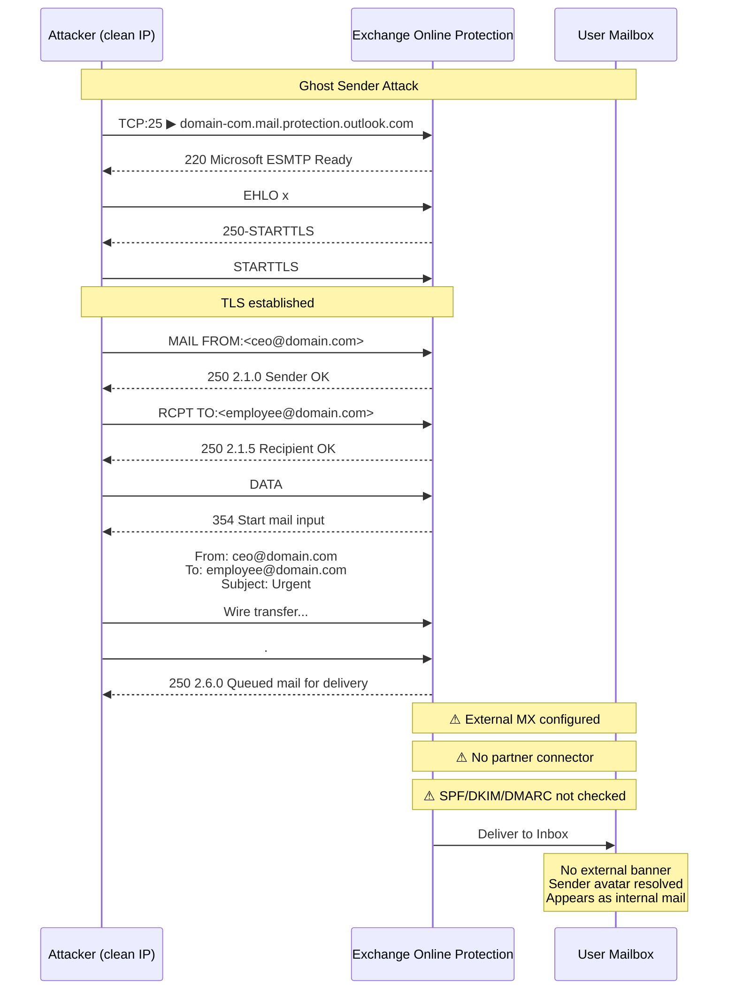
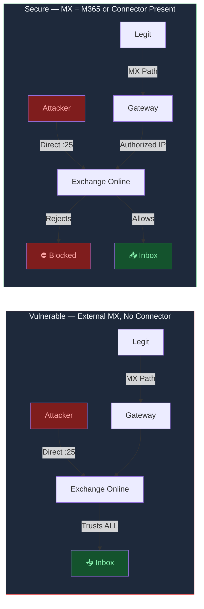

# Ghost Sender — Exchange Online Email Spoofing PoC

Proof-of-concept for the **Ghost Sender** vulnerability affecting Exchange Online tenants that use an external MX record without a partner connector or transport rule.

When exploited, an attacker delivers spoofed emails directly to any user's inbox bypassing SPF, DKIM, and DMARC — with no external warning banner.

## Background

| Resource | Link |
|----------|------|
| InfoGuard Labs Disclosure | https://labs.infoguard.ch/posts/ghost-sender/ |
| Microsoft Guidance | https://techcommunity.microsoft.com/blog/exchange/direct-send-vs-sending-directly-to-an-exchange-online-tenant/4439865 |

---

## The Vulnerability

### Vulnerable Configuration

When an organization uses Exchange Online behind a third-party email gateway (external MX record) **without** a partner connector or transport rule:

```
                        NORMAL PATH (Legitimate)
                        ========================
    Legitimate ──────▶ MX Gateway ──────▶ Exchange Online ──────▶ Inbox
    Sender            (Filtered)          (Trusted)              ✓ Delivered


                        ATTACK PATH (Ghost Sender)
                        =========================
    Attacker ──────▶ Exchange Online ──────▶ Inbox
    (clean IP)       (Direct TCP:25)         ✓ Delivered
                     (Bypasses MX!)          ✗ No SPF check
                                              ✗ No DKIM check
                                              ✗ No DMARC check
                                              ✗ No warning banner
```

**Why:** Exchange Online, when fronted by an external MX, treats ALL inbound mail as "already filtered" and does NOT perform its own SPF/DKIM/DMARC enforcement. The attacker opens a TCP connection directly to the tenant's M365 EOP endpoint (`domain-com.mail.protection.outlook.com:25`) and delivers email as if it came through the trusted gateway.

### What Gets Bypassed

| Mechanism | Configuration | Result |
|-----------|--------------|--------|
| **SPF** | `-all` (hard fail) | **Ignored** — no check performed |
| **DKIM** | Signed by Microsoft | **Ignored** — no signature required |
| **DMARC** | `p=reject; aspf=s; adkim=s` | **Ignored** — not evaluated |
| **External Banner** | Gateway warning | **Not shown** — appears internal |
| **Sender Avatar** | Profile photo | **Resolved** — for internal senders |

### Real-World Test Results

| Domain | MX | Connector | Result |
|--------|-----|-----------|--------|
| `vulnerable-domain.com` | External (Forcepoint) | ✗ None | **Vulnerable** — spoofed email delivered to inbox, no banner |
| `secure-domain.com` | Exchange Online Protection | ✓ Direct M365 | **Secure** — DMARC enforced, rejected or quarantined |

---

## Quick Start

### One-Liner PoC (Single Email)

```bash
./send.sh target-domain.com sender@domain.com victim@domain.com
```

### Mail Server (Web UI + Multi-Recipient + CC)

```bash
python3 mail-server.py
# → http://localhost:8080
```

**API:**
```bash
curl -X POST http://localhost:8080/send \
  -d "from=sender@domain.com" \
  -d "to=victim1@domain.com,victim2@domain.com" \
  -d "cc=witness@domain.com" \
  -d "subject=Test" \
  -d "body=Message"
```

Response:
```json
{
  "success": true,
  "message": "Sent 3/3",
  "results": [
    {"to": "victim1@domain.com", "success": true, "msg": "250 2.6.0 Queued mail for delivery"}
  ]
}
```

---

## Technical Flow



### Secure vs Vulnerable



---

## Requirements

- **Python 3.6+** (stdlib only — no pip installs needed for `mail-server.py`)
- **Outbound TCP port 25** not blocked
  - AWS EC2: ✓ allowed
  - Oracle Cloud: ✗ blocked (requires support ticket)
  - Residential ISP: ✗ usually blocked
- **Clean IP** — not on Spamhaus PBL/SBL
  - Request removal: https://check.spamhaus.org

---

## Fix — Exchange Admin Center

Implement **one** of these:

### Option 1: Partner Organization Connector ✅ Recommended

```
Exchange Admin Center → Mail Flow → Connectors → Add connector
├── From: Partner organization
├── Identify by: Sender's IP address
├── IP ranges: [Your MX gateway IP ranges]
└── Security: ☑ Reject email if not sent from within this IP range
```

### Option 2: Transport Rule (Priority 0)

```
Exchange Admin Center → Mail Flow → Rules → New rule
├── Apply if: Sender is located outside the organization
├── AND: Sender IP addresses NOT in [Your MX gateway IP ranges]
├── Do: Reject the message with status 5.7.1
└── Priority: 0 (highest)
```

### Option 3: Point MX Directly to M365

```
Remove external MX → Use: domain-com.mail.protection.outlook.com
Enable Enhanced Filtering for Connectors if third-party filtering retained.
```

---

## How to Check Your Domain

```bash
# Check MX — is it pointing to an external gateway?
dig +short MX your-domain.com

# If MX = your-domain-com.mail.protection.outlook.com → You are SECURE
# If MX = anything else AND no connector → You may be VULNERABLE

# Check if M365 EOP accepts direct connections:
echo "QUIT" | openssl s_client -connect $(echo your-domain.com | tr '.' '-').mail.protection.outlook.com:25 -starttls smtp -crlf -quiet 2>/dev/null | head -1

# If you see "220 ... Microsoft ESMTP" → M365 EOP is reachable directly
```

---

## Files

| File | Purpose |
|------|---------|
| `send.sh` | One-liner PoC — single spoofed email via openssl |
| `mail-server.py` | Full mail server with web UI at `:8080`, CC, multi-recipient, JSON API |

## Authorized Use Only

This tool is for testing your own infrastructure or domains you have written authorization to test. Do not use against systems without explicit permission.
